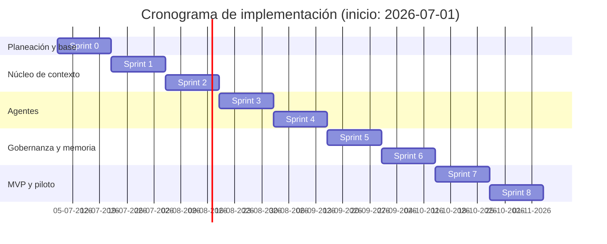

# Cronograma de implementación por sprints

> Fecha tentativa de inicio del proyecto: **1 de julio de 2026**.

## 1. Supuestos de planificación

- Duración de sprint: 2 semanas.
- Cadencia: Sprint 0 + 8 sprints de construcción.
- Enfoque: entregar MVP funcional con gobernanza humana y evolución controlada.

## 2. Cronograma por sprint

| Sprint | Fechas tentativas | Objetivo principal | Entregables clave |
|---|---|---|---|
| Sprint 0 | 2026-07-01 a 2026-07-14 | Preparación técnica y base de datos | Modelo de datos, tenant_id transversal, ambientes base, backlog refinado |
| Sprint 1 | 2026-07-15 a 2026-07-28 | Fundaciones de contexto institucional | OrganizationalContextStore, OnboardingService base, autenticación mínima |
| Sprint 2 | 2026-07-29 a 2026-08-11 | Núcleo de marca y completitud | BrandGuidelinesStore, lectura de marca con LLM multimodal, CompletenessScorer |
| Sprint 3 | 2026-08-12 a 2026-08-25 | Agente Estratégico | Flujo conversacional estratégico, brief institucional inicial |
| Sprint 4 | 2026-08-26 a 2026-09-08 | Agente Creativo y formatos | CreativeAgent, ChannelFormatters (email/Instagram/WhatsApp/web) |
| Sprint 5 | 2026-09-09 a 2026-09-22 | Gobernanza y validación humana | HumanValidationModule, reglas de aprobación/rechazo, trazabilidad funcional |
| Sprint 6 | 2026-09-23 a 2026-10-06 | Histórico y recuperación de contexto | CampaignHistoryStore, ContextRetrievalService, reutilización de campañas |
| Sprint 7 | 2026-10-07 a 2026-10-20 | Entrega operativa MVP | Export/PublishingAdapter (exportación asistida), hardening técnico |
| Sprint 8 | 2026-10-21 a 2026-11-03 | Estabilización y salida a piloto | ObservabilityService, pruebas E2E, checklist de seguridad, preparación piloto |

## 3. Diagrama de Gantt

## 4. Hitos de control

- Hito 1 (fin Sprint 2): Perfil institucional persistente operativo.
- Hito 2 (fin Sprint 4): Flujo completo de estrategia + creatividad por canal.
- Hito 3 (fin Sprint 6): Memoria organizacional y recuperación contextual habilitadas.
- Hito 4 (fin Sprint 8): MVP estabilizado y listo para piloto controlado.

## 5. Dependencias críticas

- Disponibilidad de insumos de marca por cliente para validar lectura con LLM.
- Definición temprana de checklist de seguridad multi-organización.
- Aprobación de canales MVP para exportación asistida.

---

Trazabilidad: [Arquitectura TO-BE](to-be-arquitectura.html) · [Preguntas para experto técnico](preguntas-experto-tecnico.html) · [Mapa de módulos](decisiones-modulos.html)
